# ThermalRoute — Microclimate Pedestrian Navigator

ThermalRoute is a climate-responsive outdoor pathfinder designed to navigate pedestrians through cities by prioritizing thermal comfort, shading, wind shielding, and natural tree coverage, rather than just geometric distance. 


Built on top of the **Infrared SDK**, **OSMnx**, and **FastAPI**, it allows users in Barcelona, Dubai, and Chennai to plan walking routes tailored specifically to their age, activity, and climate preferences.

---

## 1. Aim, Objective, & Use Case

### Aim
To mitigate urban heat island effects and protect pedestrians from extreme thermal stress by offering comfortable, shaded, and aesthetically enriched walking alternatives in high-temperature environments.

### Objective
- Integrate real-world physics simulation (Universal Thermal Climate Index, Lawson Pedestrian Wind Comfort, Solar Radiation) directly into urban street graph routing.
- Deliver personalized, age-responsive, and activity-specific routes (commuters, runners, parents, seniors).
- Build a responsive, beautiful web interface mapping street segments dynamically using custom comfort palettes.

### Key Use Cases
- **Senior Strollers**: A 70+ year old resident walking in Barcelona during summer afternoons, needing maximized tree cover and building shadows.
- **Urban Runners**: Active joggers in Dubai seeking loops with minimized solar radiation and maximized wind shielding to avoid heat exhaust.
- **Commuters**: Morning workers desiring direct transit routes with high wind comfort levels.

---

## 2. Methodology & Description

ThermalRoute implements a **Raster-to-Vector Microclimate Correlation Pipeline**:

```
[Infrared Physics API] ──────> [Float32 Numpy Raster Grids]
                                         │
                                         ▼ (Coordinate Alignment)
[OpenStreetMap Graph] ───────> [Grid Sampling at Edge Midpoints]
                                         │
                                         ▼ (Enrichment)
[Persona Custom Weights] ────> [AStar/Dijkstra Edge Cost Formulation]
                                         │
                                         ▼
                               [Optimised Walking Route]
```

### The Multi-Grid Correlation Process
1. **Geometric Bounding Box**: Tight bounding boxes are calculated around stops (typical/multi-stop) or projected loop parameters.
2. **Physics Simulations**: The **Infrared SDK** runs three concurrent simulations over the region:
   - **Universal Thermal Climate Index (UTCI)**: outdoor feels-like temperature.
   - **Wind Speed**:Steady-state CFD wind vectors.
   - **Solar Radiation**: Direct and diffuse horizontal sun hours (W/m²).
3. **Graph Edge Sampling**: The resulting float32 grids are mapped to OSM street edges. Short edges ($\le100\text{m}$) sample the grid at their geometric midpoint. Long edges ($>100\text{m}$) compute a 5-point interpolated average to capture shadow/wind changes.
4. **Vegetation Spatial Trees**: Tree geometries returned by the SDK are indexed into a **Shapely STRtree** to evaluate tree counts within a $50\text{m}$ path buffer.
5. **Cost Formulation**: Edge weights are calculated based on the persona's custom weight vector:

$$\text{Cost} = \left( w_{\text{speed}} \cdot \frac{\text{length}}{100} + w_{\text{shade}} \cdot (1 - \text{shade}) + w_{\text{nature}} \cdot (1 - \text{veg}) + w_{\text{discovery}} \cdot (1 - \text{POI}) + w_{\text{speed}} \cdot \text{surface} + w_{\text{speed}} \cdot \text{safety} \right) \cdot \text{length}$$

---

## 3. System Architecture

ThermalRoute is split into a modular decoupled architecture:

```
├── backend/
│   ├── main.py                # FastAPI Application Scaffold
│   ├── models/
│   │   ├── request_models.py  # Input validation schemas
│   │   └── response_models.py # Unified output models
│   ├── routers/
│   │   ├── route.py           # Orchestrates path calculations
│   │   ├── personas.py        # Preset and Custom persona handlers
│   │   └── cache.py           # Monitoring status API
│   ├── services/
│   │   ├── sdk_service.py     # Area, weather, and run client calls
│   │   ├── osm_service.py     # Graph downloads, POIs, costs
│   │   ├── routing_service.py # Dijkstra, Multi-stop & Loop algorithms
│   │   └── cache_service.py   # Base64 serialization of grids and vegetation
│   └── utils/
│       ├── grid_sampler.py    # Spatial midpoint & average sampler
│       ├── bbox.py            # Coordinate rounding & rings builder
│       └── normalise.py       # HSL/Safety dictionaries & age adjustments
│
└── frontend/
    ├── src/
    │   ├── components/
    │   │   ├── Sidebar.tsx    # Inputs, Sliders, warnings
    │   │   ├── MapPanel.tsx   # Leaflet paths rendering
    │   │   ├── LocationInput.tsx # Autocomplete search suggestions
    │   │   ├── ResultSummary.tsx # Bottom metrics dashboard
    │   │   └── LoadingOverlay.tsx # Cycles calculations state
    │   ├── hooks/             # Custom Nominatim & Polling React Query hooks
    │   ├── store/             # Zustand Global router store
    │   └── utils/             # Color scale & city bounding configurations
```

---

## 4. Mermaid Flow Diagram

This diagram displays the unified sequence flow from the initial frontend geocoding request to the final backend computation and polling:

```mermaid
sequenceDiagram
    autonumber
    actor User
    participant FE as React Frontend
    participant BE as FastAPI Backend
    participant DB as Supabase DB
    participant SDK as Infrared Physics API
    participant OSM as OpenStreetMap (Nominatim)

    User->>FE: Input location suggestions query
    FE->>OSM: Request coordinates inside viewbox boundary
    OSM-->>FE: Return geocoded coordinate candidates
    User->>FE: Click "Find Comfort Route"
    FE->>BE: POST /api/v1/route (stops, time_slot, weights)
    BE-->>FE: Return 202 accepted (job_id)
    
    rect rgb(15, 23, 42)
        Note over BE: Asynchronous Background Task runs
        BE->>DB: Query cached grid matching bbox + slot + analyses
        alt Cache HIT
            DB-->>BE: Return cached float32 Base64 grids & vegetation
        else Cache MISS
            BE->>SDK: get_area() & filter_weather_data() & run_area_and_wait()
            SDK-->>BE: Return UTCI, wind, and solar grids
            BE->>DB: Persist new grids to sdk_cache table (24h TTL)
        end
        BE->>OSM: Download street walk network graph
        BE->>BE: Sample grid cells into graph edges
        BE->>BE: Run A* / Dijkstra path calculations
        BE->>DB: Log summary statistics into route_requests table
    end

    loop Every 2 seconds
        FE->>BE: GET /api/v1/route/status/{job_id}
        BE-->>FE: Return processing status / computed route result
    end
    FE-->>User: Render UTCI colored paths and floats result card
```



---

## 5. Local Usage

### Backend Server Setup
1. Navigate to the backend directory:
   ```bash
   cd backend
   ```
2. Activate your virtual environment and install requirements:
   ```bash
   # Windows
   ..\..\.venv\Scripts\activate
   pip install -r requirements.txt
   ```
3. Configure your `.env` credentials file:
   ```env
   INFRARED_API_KEY=your_infrared_city_api_key
   SUPABASE_URL=your_supabase_url
   SUPABASE_KEY=your_supabase_anon_key
   GEMINI_API_KEY=your_gemini_developer_key
   ```
4. Fire up the API server:
   ```bash
   uvicorn main:app --reload --port 8000
   ```

### Frontend Server Setup
1. Navigate to the frontend directory:
   ```bash
   cd ../frontend
   ```
2. Install client dependencies:
   ```bash
   npm install
   ```
3. Launch the hot-reloading dev environment:
   ```bash
   npm run dev
   ```

---

## 6. Work In Progress (WIP) & Future Versions

### Work In Progress (WIP)
- **Automatic Superblock Boundary Detection**: Renders visual badges on locations passing through Barcelona's pedestrianized superblocks (*Superilles*).
- **In-Memory Cache Fallbacks**: Providing mock climate datasets locally to streamline server execution if Supabase goes offline.

### Future Roadmap
- **Step 9 — Gemini Narrative Generator**: Refactoring `gemini_service` to generate highly tailored 2-sentence textual walk explanations (e.g., *"This route routes you past a series of dense oak trees, keeping feels-like heat 3°C lower than the highway"*).
- **Multi-Day Heatwave Predictions**: Integrate real-time weather forecasts to dynamically adapt path scores over a 7-day predictive timeline.
- **AR Navigation Integration**: Renders comfort overlays through mobile web camera streams.
